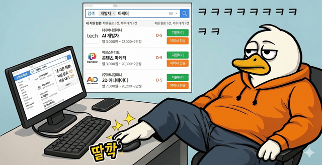

# 🦆 4848로 주식을 이겨라! (Hidden Trader)

> 종목은 비밀. 차트만 보고 매매해서 **Buy & Hold**를 이기면 승리.

무작위 종목의 무작위 시점에서 시작되는 "블라인드 트레이딩" 게임.
과거 1년치 일간 차트만 보고 라운드마다 `롱 / 숏 / 플랫` 중 하나를 골라
N라운드 동안 운영한 뒤, 같은 돈을 처음에 사서 가만히 들고만 있었을 때
(Buy & Hold) 수익률과 비교합니다. 알파가 플러스면 **승리**, 아니면 **패배**.



---

## 📑 목차

- [최근 업데이트](#-최근-업데이트-2026-04-15--2026-04-17)
- [핵심 컨셉](#-핵심-컨셉)
- [기능](#-기능)
- [실행 방법](#-실행-방법)
- [초보자 가이드](#-초보자-가이드-주식을-한번도-안-해본-사람을-위한-매뉴얼)
- [게임 방법](#-게임-방법-자세한-가이드)
- [기술 스택](#-기술-스택)
- [프로젝트 구조](#-프로젝트-구조)
- [커스터마이즈](#-커스터마이즈)
- [설계 노트](#-설계-노트)
- [문제 해결](#-문제-해결-troubleshooting)
- [크레딧](#-크레딧)

---

## 📰 최근 업데이트 (2026-04-15 ~ 2026-04-17)

### 2026-04-17

- 🎯 **신규 게임 모드 "다음날 맞추기" 출시**
  - 상단 세그먼트에서 `🎰 리밸런싱(메인)` / `🎯 다음날 맞추기` 선택
  - **판수** 10 / 20 / 직접입력(1~20) · 기본 **10판**
  - **예측 기간** 일(1d) / 주(5d) / 월(21d) · 기본 **주**
  - 시작 시 20개까지의 무작위 1년치 차트를 미리 로딩(진행바 + 10~20초 안내)
  - 한 문제씩 차트를 보여주고 "오른다 / 내린다" 중 선택 → **실제 해당 기간만큼의 캔들을 붙여서 공개** + 변화율·가격 표시 → "다음 →"으로 이동
  - 최종 **승률 20% 단위 6등급** 평가 (완벽적중 / 승리 / 괜찮아 / 애매 / 패배 / 완전패배 — 기존 이미지 재활용)
  - 결과창에서 20문제 그리드 클릭 시 해당 차트 복기
- 🎨 첫 화면 장식 정리 — 배경 이모지/밈·대박 신호 텍스트·부제 문구 정돈, 네온 배경은 Setup으로만 이동
- 🔮 훈수꾼 복기 시스템 + 라운드/종목 UI 정리 (결과 화면에서 각 분석가 선택 시 그들의 매매 내역·자산 곡선 비교)

### 2026-04-16

- 🎨 **테마 시스템**: 기본(어두운) / 무지개(Gaegu 손글씨 + 공책 줄무늬) / 네온(Press Start 2P + 레트로 도시 픽셀아트) — 차트/결과창/폰트까지 모두 테마 연동, 새로고침 시 테마 랜덤화 가능
- 🎵 **BGM 랜덤 재생**: 테마별로 여러 트랙 중 랜덤 선택, 128kbps 음질 업그레이드
- 🎯 **콤보/격언/연패 오리**: 연승 시 콤보 토스트(NICE→AMAZING→UNSTOPPABLE→LEGENDARY), 연패 시 우는 오리 멘트, 거래마다 주식 격언 50선
- 👑 **완전승리/완전패배** 이미지 + 전용 효과음 추가
- 🏆 **GA4 + Firestore 랭킹**: 닉네임 + CAGR 기준 전 세계 랭킹, 알파 음수면 등록 제외, 동일 닉네임은 최고점만 유지
- 🚫 **1,256개 비속어 필터**: 게임 플레이는 가능, 랭킹 등록만 차단

### 2026-04-15

- 📊 결과 화면 재구성 — 복기 모드 최상단 배치, 스탯 6카드 × 카드 그리드 정렬
- 🏅 **승률 2종 표시** — 포지션 기준(왕복 거래 승률) / 라운드 기준(방향 맞춘 비율)
- 🔮 훈수 모달에 분석가 그룹 구분 (추세추종 / 밴드 / 일목균형표)

---

## 🎯 핵심 컨셉

- **편향 제거**: 종목명과 기간이 가려진 채로 차트만 보고 판단 — 유명주 프리미엄 영향 제거
- **무작위 샘플링**: 종목 + 시점 + 구간을 매번 랜덤 — 매 판이 다름
- **명확한 기준**: Buy & Hold 대비 알파를 기준으로 승패 판정
- **현실적 제약**: 수수료 0.1%, 100% 풀 포지션, 수정주가(split/div) 기준

## ✨ 기능

### 🕹️ 게임 모드 (2종)

- **🎰 리밸런싱 모드 (메인)** — 라운드마다 롱/숏/플랫 선택, Buy & Hold 대비 알파로 승패 판정
- **🎯 다음날 맞추기 모드** — 10~20개의 무작위 1년치 차트, 선택한 기간(일/주/월, 기본 주) 뒤 상승/하락만 찍기, 승률 20% 단위 6등급 평가

### 🌈 UI / UX

- **3가지 테마**: 기본(어두운) / 무지개(Gaegu 손글씨 + 공책 줄무늬) / 네온(Press Start 2P + 레트로 픽셀아트)
- 테마별 차트 색상·폰트·BGM·배경 이미지 연동, 우하단 🔊 토글
- **반응형 레이아웃** — 휴대폰 가로 모드에서 좌측 차트 + 우측 사이드바 자동 전환
- 키보드 단축키(B/S/F/H/Space, 다음날 맞추기: B/↑ S/↓), 배경음악 토글(localStorage 저장)
- 도움말 모달(`?` 버튼)

### 📈 차트 & 지표

- 4개 카테고리 종목 풀(미국 / 일본 / 한국 / 주가지수) — 언제든 확장 가능
- 리밸런싱 모드: 라운드 수(3·5·10·20·50·100) × 리밸런싱 주기(일·주·월·분기·반기) 커스터마이즈
- 롤링 1년(252거래일) 윈도우로 차트 표시
- **20+ 기술적 지표 토글**: SMA(5/20/50/120), EMA(12/26), WMA, KAMA, 볼린저밴드, PSAR, VWAP,
  SuperTrend, 일목균형표, RSI, MACD, Stochastic, StochRSI, CCI, Williams %R, ROC, TRIX,
  AO, ADX, ATR, %B, BBW, Volume, OBV, MFI
- 매수/매도/공매도/환매 화살표 차트 오버레이

### 🔮 훈수 & 피드백

- **훈수 기능** — 분석가 5명(이평 할배, MACD 박사, RSI 선생, BB 형님, 일목 도사)의 의견을
  게임당 5회 조회 가능. 캐릭터별 말투(사투리·학자 톤·건달 형님·무협 도사).
  추세추종 / 밴드 / 일목균형표 3그룹으로 구분 표시
- 결과창에서 **훈수꾼 복기** — 각 분석가를 선택하면 매매 내역·자산 곡선 비교
- 라운드별 즉시 피드백 — 플러스면 큰 "굿!", 마이너스면 "땡!" 토스트
- **콤보 시스템** — 연승 시 NICE→AMAZING→UNSTOPPABLE→LEGENDARY 토스트, 연패 시 우는 오리 멘트
- 거래마다 **주식 격언 50선** 중 하나가 스쳐 지나감

### 🏆 랭킹 & 기록

- **완벽승리(👑)** — 승리 + 승률 90% 이상일 때 특별 이미지/효과음
- **GA4 + Firestore 랭킹** — CAGR 기준 전 세계 랭킹, 알파 음수면 등록 제외, 동일 닉네임은 최고점만 유지
- 닉네임 미입력 시 랜덤 배정 · 1,256개 비속어 필터(게임은 가능, 랭킹 등록만 차단)
- 결과 통계: 누적·연환산(CAGR) 수익률, 알파, MDD, 연환산 샤프, 2종 승률(포지션/라운드), 거래내역
- 자산곡선 vs Buy & Hold 오버레이 차트, 복기 모드(전체 차트 + 매매 포인트)
- **최근 10게임** 히스토리 localStorage 저장, 시작 화면에 목록 표시

---

## 🚀 실행 방법

### 1. 요구사항

- **Node.js 20 이상** (권장 22 LTS) — https://nodejs.org
- **npm 10+** (Node에 포함됨) 또는 pnpm, yarn
- 인터넷 연결 (Yahoo Finance API 호출)
- 최신 데스크톱 브라우저 (Chrome / Edge / Firefox / Safari)

설치 확인:
```bash
node --version   # v20 이상
npm  --version   # 10 이상
```

### 2. 소스 받기

```bash
git clone https://github.com/htk1019/ungdroo-stock-trading-game.git
cd ungdroo-stock-trading-game
```

### 3. 의존성 설치

```bash
npm install
```

약 170개 패키지가 설치됩니다. 2~3분 정도 걸릴 수 있어요.

### 4. 개발 서버 실행

```bash
npm run dev
```

다음과 같은 출력이 나오면 성공:

```
  VITE v8.x.x  ready in ~2000 ms
  ➜  Local:   http://localhost:5000/
  ➜  Network: http://192.168.x.x:5000/
```

브라우저에서 **http://localhost:5000** 을 열면 시작 화면이 뜹니다.

> ⚠️ **포트 5000이 이미 사용 중이라면**: `vite.config.ts`에서 `server.port`를 바꾸거나,
> 포트를 점유 중인 프로세스를 종료하세요. Windows: `netstat -ano | findstr :5000` 으로
> PID 찾고 `taskkill /PID <pid> /F`.

### 5. 기타 명령

| 명령 | 설명 |
|---|---|
| `npm run dev` | 개발 서버 (HMR, Yahoo 프록시 포함) |
| `npm run build` | 타입체크 + 프로덕션 번들 (`dist/`) |
| `npm run preview` | `dist/` 번들을 로컬에서 미리보기 |
| `npm run lint` | ESLint 검사 |
| `npx tsc --noEmit` | 타입체크만 실행 |

### 6. 프로덕션 배포 (선택)

Vite dev 서버의 프록시(`/yf → query1.finance.yahoo.com`)는 배포 시에는 없습니다.
배포하려면 같은 경로를 중계해줄 **간단한 백엔드 또는 서버리스 함수**가 필요합니다. 예:

- **Vercel / Netlify Functions**: `/api/yf/*` 같은 함수로 요청 프록시
- **Cloudflare Workers**: 라우트로 Yahoo에 fetch
- **Express**: `app.use('/yf', createProxyMiddleware({ target: 'https://query1.finance.yahoo.com', changeOrigin: true, pathRewrite: { '^/yf': '' } }))`

프론트엔드는 정적 파일이므로 `npm run build` 후 `dist/`를 그대로 호스팅하면 됩니다.

---

## 👶 초보자 가이드 (주식을 한번도 안 해본 사람을 위한 매뉴얼)

이 게임을 즐기기 위해 필요한 개념만 **딱 필요한 만큼** 짧게 정리했어요.

### 1. "주식을 산다"는 게 뭔가요?

회사 지분을 작게 쪼갠 조각(주식)을 돈 주고 사는 거예요. 산 값보다 비싸게
팔면 이익(**수익**), 싸게 팔면 손실. 시세는 실시간으로 바뀌니까 "언제
사고 언제 파는가"가 전부.

### 2. 이 게임의 **롱(Long)** = 그냥 "사기"

- **롱 진입** = 현금으로 주식을 **산다** → 주가가 오르면 돈을 번다
- **롱 청산** = 가진 주식을 **판다** → 이익/손실 확정

일반적인 주식 거래가 바로 롱이에요.

### 3. **숏(Short, 공매도)** = "없는 걸 먼저 팔고, 나중에 다시 사서 갚기"

직관적이지 않지만 간단해요:

1. 증권사에서 주식을 **빌려서 시장에 판다** → 현금이 생김
2. 나중에 같은 수량을 **시장에서 다시 사서** 증권사에 돌려줌
3. 팔았을 때 가격 **>** 되샀을 때 가격 → 차액만큼 내 이익

즉 **주가가 내릴 거라 예상할 때** 쓰는 포지션.

- **숏 진입** = 빌려서 판다 (현금 유입)
- **숏 청산 = 환매** = 시장에서 다시 사서 갚는다
- 주가 **내리면 이익**, 오르면 손실

이 게임에선 이 과정을 자동으로 계산해 주니까 "하락 베팅 버튼" 정도로
생각하면 돼요.

### 4. **플랫(Flat)** = 아무것도 안 들고 있다

현금만 들고 있는 상태. 주가가 오르든 내리든 내 돈은 안 변해요. "방향
모르겠다, 일단 지켜본다"일 때 쓰는 안전 카드.

### 5. **Buy & Hold (B&H, 벤치마크)**

"처음에 사서 끝까지 그냥 들고만 있기." 아무것도 안 하는 전략. 이 게임은
당신의 매매 성과를 **이 기본 전략과 비교**해서 승패를 판정해요.

- 당신 수익률 **>** B&H 수익률 → 🎉 **승리**
- 당신 수익률 **<** B&H 수익률 → 😢 **패배**

주가가 많이 올라서 당신도 +30% 벌었더라도, B&H가 +50%면 **패배**예요.
반대로 둘 다 -20% 손실이어도 당신이 덜 잃었으면 **승리**.

### 6. **캔들(봉) 읽는 법**

차트의 각 막대 하나 = 하루의 시세를 요약한 것:

```
    │  ← 고가(그 날 최고가)
   ┌┴┐
   │ │ ← 종가(마감)
   │ │   초록(양봉): 종가 > 시가 → 오른 날
   │ │   빨강(음봉): 종가 < 시가 → 내린 날
   └┬┘ ← 시가(시작)
    │  ← 저가(최저가)
```

막대의 **길이**는 당일 변동폭, **색깔**은 방향. 꼬리(세로선)는 장중
최고·최저를 보여줌.

### 7. **이동평균선(SMA/EMA)** — "최근 N일 평균가"

- **SMA5** (짧은): 최근 5일 종가 평균. 단기 추세. 민감하게 움직임.
- **SMA20**: 중기 추세. 제일 기본선.
- **SMA50**: 중장기.
- **SMA120**: 장기. 잘 안 꺾임.
- **EMA12**: 최근 데이터에 가중치. SMA보다 반응이 빠름.

**실전 활용**:
- 짧은 선이 긴 선 **위에** 있으면 상승 추세 (정배열) → 롱에 유리
- 짧은 선이 긴 선 **아래** 있으면 하락 추세 (역배열) → 숏 고려
- 짧은 선이 긴 선을 **뚫고 올라감(골든크로스)** → 추세 전환 힌트

### 8. **RSI(14)** — "과매수/과매도" 지표 (0~100)

- **70 이상**: 너무 많이 올라감 → 조정 올 수 있음 → 청산/숏 고민
- **30 이하**: 너무 많이 내려감 → 반등 올 수 있음 → 롱 고민
- **30~70**: 보통

### 9. **MACD(12,26,9)** — "추세 모멘텀"

두 선(MACD, 시그널)과 막대(히스토그램)로 구성. 세세한 해석보단 딱 하나:

- **히스토그램이 음수 → 양수로 바뀌는 순간** = 상승 모멘텀 시작 힌트
- **양수 → 음수** = 하락 모멘텀 시작 힌트

### 10. **거래량**

그 날 얼마나 많이 거래됐는지. 급등/급락 때 거래량이 크게 찍히면
"진짜 움직임"이고, 거래량 없는 움직임은 **신뢰도 낮음**. 주가지수
카테고리는 거래량 패널 생략됨.

### 11. **수수료 0.1%**

진입 한번, 청산 한번마다 0.1%씩 떼어가요 (왕복 0.2%). 작아 보여도
라운드를 많이 굴릴수록 누적 타격. **방향 확신 없을 때 억지로 베팅하면
수수료로 손실 고정**이에요 → 그럴 땐 "관망(플랫)"이 정답.

### 12. **최대 낙폭(MDD, Max Drawdown)**

게임 도중 자산이 **고점 대비 얼마나 깊이 빠졌는지**. -20% MDD면 중간에
최고점에서 20% 떨어진 적이 있다는 뜻. 수익률이 같아도 MDD가 작을수록
**심리적으로 편한 운용**.

### 13. **샤프(Sharpe) 비율**

수익률을 변동성으로 나눈 값. **수익률 대비 얼마나 변동이 덜했는지**를
보는 지표. 클수록 좋아요 (1 이상이면 괜찮음).

### 14. **승률 (2종)**

이 게임은 승률을 두 가지로 보여줍니다.

- **승률 (포지션)**: 진입→청산 왕복 거래 중 수익 난 비율.
  전통적 트레이더 지표. 장기 보유 후 한 번에 청산하면 1회로 카운트.
- **승률 (라운드)**: 포지션 보유 라운드에서 방향 맞춘 비율 (현금 보유는 제외).
  "매 라운드 방향 맞추기" 관점 — 이 게임 UX에 더 직관적.
  예: 10라운드 롱 유지 중 7번 상승 = 7/10 = 70%.

두 지표는 관점이 달라 숫자가 크게 다를 수 있습니다.
승률이 낮아도 이긴 거래의 폭이 크면 총 수익은 플러스일 수 있어요.

### 15. **실전 전략 3가지 (게임에서 해볼 만한 것)**

1. **추세 추종 (Trend Following)**
   - SMA5 > SMA20 > SMA50 (정배열)이면 롱, 역배열이면 숏
   - 배열이 깨지면 청산
   - 단순하지만 역사적으로 통계적 우위 있음

2. **평균 회귀 (Mean Reversion)**
   - RSI < 30이면 롱 진입, RSI > 70이면 청산
   - 박스권에서 유리, 강한 추세장에선 불리

3. **패시브 (관망 위주)**
   - 확신 있을 때만 진입, 애매하면 플랫
   - 수수료를 아껴서 적은 승수로도 BM 이기기
   - **초보에게 추천**

### 16. ⚠️ 게임 ≠ 실제 투자

이건 과거 데이터 기반 시뮬레이션 게임이에요. 실제 시장엔:
- 실시간 슬리피지, 세금, 환전 수수료, 배당 세금
- 호가 스프레드, 공매도 차입 비용 및 대차 불가 종목
- 뉴스/공시/거시 지표의 비선형 영향
- **본인의 심리** (제일 크다)

모두 이 게임엔 빠져 있어요. 재미 + 차트 읽기 연습용으로만 쓰세요. 실
투자는 자기 돈으로 책임져야 하는 완전히 다른 게임입니다.

---

## 🎮 게임 방법 (자세한 가이드)

### 시작 화면 (Setup)

상단 세그먼트에서 **게임 모드**를 먼저 고르세요: `🎰 리밸런싱(메인)` / `🎯 다음날 맞추기`.

#### 공통 선택

1. **종목 카테고리** (복수 선택)
   - **미국**: AAPL, MSFT, NVDA 등 약 60종
   - **일본**: 토요타, 소니, 닌텐도 등 12종 (`.T`)
   - **한국**: 삼성전자, SK하이닉스, 네이버 등 20종 (`.KS`)
   - **주가지수**: S&P500, NASDAQ, KOSPI, 닛케이 등 11종 (거래량 패널 숨김)
2. **닉네임** (랭킹용) — 미입력 시 랜덤 배정. 1,256개 비속어는 랭킹 등록 차단.
3. **테마** — 기본 / 무지개 / 네온 (카드 왼쪽 위 테마 버튼)

#### 🎰 리밸런싱 모드에서 추가로 선택

1. **라운드 수**: `3 / 5 / 10 / 20 / 50 / 100` (혹은 직접입력 1~200)
2. **라운드별 리밸런싱 주기**
   - **일** = 1거래일 · **주** = 5거래일 · **월** = 21거래일 · **분기** = 63거래일 · **반기** = 126거래일
   - 총 트레이딩 기간 = `라운드 수 × 리밸런싱 주기` (예: 20라운드 × 주 = 100거래일 ≈ 5개월)

`🎰 딸깍! 시작하기` 버튼을 누르면 랜덤 종목의 과거 어느 1년 구간이 무작위로 선정됩니다.

#### 🎯 다음날 맞추기 모드에서 추가로 선택

1. **판수**: `10 / 20 / 직접입력(1~20)` · 기본 **10판**
2. **예측 기간**: `일(1d) / 주(5d) / 월(21d)` · 기본 **주**

`🎯 N문제 시작하기`를 누르면 선택한 카테고리에서 **N개의 무작위 종목 · 각자 무작위 1년 구간** 차트를 **미리 모두 불러온 뒤** 한 문제씩 보여줍니다. 로딩 진행바(`N/N` + %)가 표시되며 보통 10~20초 소요.

> 💡 **데이터 부족 주의**: 비미국 종목은 상장 이력이 짧거나 Yahoo의 응답에
> 한계가 있을 수 있어요. (워밍업 252일 + 트레이딩 기간 / 예측 기간)을 만족하는
> 종목이 없으면 에러가 뜹니다. 이 경우 라운드 주기/예측 기간을 줄이거나
> 카테고리에 `미국`을 포함하세요.

### 플레이 화면 (Play)

상단에 포지션 / 진행 정보와 5개 큰 지표가 표시됩니다.

- **포지션 배지**: `무포지션` / `롱` / `숏`
- **라운드**: 현재/전체
- **+Nd/회**: 한 라운드당 진행되는 거래일 수
- **현재가**: 최근 캔들 종가
- **보유현금 / 번돈 / 평가 / BM 금액 / 수익률**

중앙은 [lightweight-charts](https://github.com/tradingview/lightweight-charts)
기반 4패인 차트:

| 패인 | 내용 |
|---|---|
| 메인 | 일봉 캔들 + 5/20/50/120 SMA + 12 EMA |
| 거래량 | 상승/하락 색상 (주가지수는 이 패인 생략) |
| RSI(14) | 30/70 기준선 대시드 표시 |
| MACD(12,26,9) | MACD 선 + 시그널 선 + 히스토그램 |

매매를 하면 해당 캔들 위/아래에 **화살표 마커**가 찍힙니다.
- 🟢 위쪽 녹색 화살표 = 매수 (롱 진입)
- 🔴 아래쪽 빨강 화살표 = 매도 (롱 청산)
- 🟡 위쪽 주황 화살표 = 공매도 (숏 진입)
- 🔵 아래쪽 하늘 화살표 = 환매 (숏 청산)

### 라운드 결정

각 라운드마다 하단 버튼 3개 중 **하나를 반드시** 골라야 합니다. 선택하면
자동으로 다음 라운드까지 시간이 흐르고, 차트가 `리밸런싱 주기`만큼 새
캔들을 공개합니다.

**포지션 상태별 선택지**:

#### 1) 무포지션(플랫)일 때
| 버튼 | 의미 | 결과 |
|---|---|---|
| 📈 오른다! 롱 진입 | 주가 상승 예상 → 전액 매수 | 롱 포지션으로 전환 |
| 📉 내린다! 숏 진입 | 주가 하락 예상 → 공매도 | 숏 포지션으로 전환 |
| 🪙 관망·현금 유지 | 방향 불명 → 아무것도 안 함 | 무포지션 유지 |

#### 2) 롱 보유 중
| 버튼 | 의미 | 결과 |
|---|---|---|
| 💰 롱 청산 → 현금 | 차익 실현 / 손절 → 팔고 현금화 | 무포지션 |
| 🔁 롱 청산 후 숏 전환 | 추세 반전 베팅 → 팔고 숏 진입 | 숏 포지션 |
| ✊ 롱 그대로 유지 | 계속 간다 → 포지션 유지 | 롱 유지 |

#### 3) 숏 보유 중
| 버튼 | 의미 | 결과 |
|---|---|---|
| 💰 숏 청산 → 현금 | 수익 실현 / 손절 → 환매 후 현금화 | 무포지션 |
| 🔁 숏 청산 후 롱 전환 | 추세 반전 베팅 → 환매 후 매수 | 롱 포지션 |
| ✊ 숏 그대로 유지 | 계속 하락 베팅 → 포지션 유지 | 숏 유지 |

**결정 직후 피드백**: 평가액이 플러스면 큰 초록 "**굿! +X.XX%**", 마이너스면
빨강 "**땡! -X.XX%**" 문구가 차트 한가운데 잠깐 떴다 사라집니다.

### 🎯 다음날 맞추기 모드 플레이 화면

각 문제마다 252거래일(≈1년) 차트가 표시되고 하단 두 버튼 중 하나를 고릅니다:

- **📈 오른다** (단축키 `B` / `↑`): 예측 기간 뒤 종가가 **상승**
- **📉 내린다** (단축키 `S` / `↓`): 예측 기간 뒤 종가가 **하락**

답 선택 직후 **실제 해당 기간만큼의 캔들이 차트에 이어붙여 공개**되고, 팝업에 `정답/오답` + 실제 방향 + 변화율(`+2.34%`) + 가격 전후(`$150.23 → $153.75`)가 표시됩니다. 2.8초 뒤 자동으로 다음 문제, 또는 `다음 →` 버튼으로 즉시 이동.

**최종 평가 (승률 20% 단위 6등급)**

| 승률 | 판정 | 이미지 |
|---|---|---|
| 100% | 👑 완벽 적중 | perfect-win |
| 80~99% | 🎯 승리 | happy |
| 60~79% | 😎 괜찮아 | happy |
| 40~59% | 🤔 애매 | meh |
| 20~39% | 📉 패배 | sad |
| 0~19% | 💀 완전패배 | total-defeat |

결과 화면에서 각 문제 카드를 클릭하면 해당 차트(정답 캔들 포함)를 복기할 수 있습니다.

### 키보드 단축키

#### 🎰 리밸런싱 모드
| 키 | 동작 |
|---|---|
| `B` | 롱 관련 액션 (무포지션→롱 / 숏→롱 전환) |
| `S` | 숏 관련 액션 (무포지션→숏 / 롱→숏 전환) |
| `F` | 플랫 (포지션 있으면 청산) |
| `Space` / `H` | 홀드 (현재 포지션 유지한 채 다음 라운드로) |

#### 🎯 다음날 맞추기 모드
| 키 | 동작 |
|---|---|
| `B` / `↑` | 📈 오른다 |
| `S` / `↓` | 📉 내린다 |

### 자산 계산 방식

- **시작 자금**: $10,000 (화폐 표시는 단일하게 $로 통일)
- **수수료**: 진입·청산 시 각 0.1% (원화 환전/세금은 무시)
- **포지션 크기**: 100% (현금 전액 또는 전액에 해당하는 공매도)
- **평가(equity)**: `현금 + 보유주식 × 현재가`
  - 롱 보유 시: 주식 수가 양수 → 가격 오르면 이익
  - 숏 보유 시: 주식 수가 음수 → 가격 내리면 이익 (`(현재가 - 진입가) × 음수 주식수` = 양수)
- **수정주가(adjclose) 기준**: 배당/액면분할이 반영된 가격으로 시뮬

### Buy & Hold 비교 (벤치마크)

게임이 시작되는 순간(첫 번째 트레이딩 캔들의 open 가격)에 $10,000으로
해당 주식을 사서 끝까지 들고 있었을 경우의 자산을 계속 추적합니다.
플레이어의 자산 곡선과 함께 결과 화면에 오버레이됩니다.

### 결과 화면

게임이 끝나면 다음이 표시됩니다:

- **승리 / 애매 / 패배 / 👑 완벽승리** 배지 + 해당 이미지와 효과음
  (완벽승리 조건: 승리 + 승률 90% 이상)
- 좌측 상단: **복기 모드** — 전체 차트 + 매매 포인트(바닐라 캔들 뷰)
- 좌측 하단: **자산곡선 vs Buy & Hold** + **거래 내역** 테이블 나란히
- 우측: 12개 통계 카드 그리드
  - 내 수익률(누적/연환산), Buy & Hold(누적/연환산), 알파(vs B&H / 연환산)
  - 기간, 최대 낙폭(MDD), 샤프(연환산)
  - 총 거래 횟수, **승률(포지션)**, **승률(라운드)**
- `다시 도전` 버튼 → 새 종목으로 재시작
- 최고 기록(연환산 수익률 기준) 및 신기록 시 🏆 배지 표시
- 결과는 localStorage에 저장 → 시작 화면 "최근 게임" 리스트에 누적

### 이기는 팁

- **SMA/EMA 정배열**(짧은 이평이 긴 이평 위) → 상승 추세 시 롱 유리
- **역배열** → 하락 추세 시 숏 고려
- **RSI > 70** → 과매수 → 청산/숏 생각
- **RSI < 30** → 과매도 → 숏 청산/롱 전환 고려
- **MACD 히스토그램 부호 전환** → 단기 추세 전환 힌트
- **방향 확신 없음 → 관망(현금 유지)** 가 세 번째 선택지인 이유. 억지로
  방향 베팅하면 수수료만 깎아먹음.

---

## 🛠️ 기술 스택

| | |
|---|---|
| UI | React 19, TypeScript, Tailwind v4 (with Vite plugin) |
| 차트 | [lightweight-charts](https://github.com/tradingview/lightweight-charts) v5 (멀티 패인) |
| 지표 | [technicalindicators](https://github.com/anandanand84/technicalindicators) |
| 데이터 | Yahoo Finance `v8/finance/chart` (Vite dev 프록시) |
| 빌드 | Vite 8 |
| 오디오 | 배경음(mp3) + Web Audio API 합성 SFX |

**Yahoo 데이터 주의점**: `range=max` 대신 `period1=0&period2=2000000000`로
요청해야 비미국 티커(`.KS`, `.T` 등)의 전체 히스토리가 옵니다.
OHLC는 `adjclose / close` 비율로 전체를 스케일하여 **수정주가** 기준으로
시뮬레이션합니다.

---

## 📁 프로젝트 구조

```
src/
├─ App.tsx                  페이즈 전환 (setup / playing / ended)
├─ main.tsx
├─ index.css                Tailwind entry + 애니메이션 키프레임
├─ lib/
│  ├─ yahoo.ts              OHLCV + adjclose 스케일 fetch
│  ├─ tickers.ts            카테고리별 종목 풀
│  ├─ engine.ts             게임 상태, 포지션 전환, CAGR/샤프/MDD/승률 2종 등
│  ├─ indicators.ts         20+ 기술적 지표 (SMA/EMA/RSI/MACD/BB/Ichimoku/Stoch/ADX/...)
│  ├─ advice.ts             훈수 - 분석가 5명의 지표 기반 판단 + 캐릭터 말투
│  ├─ highscore.ts          최고 기록(CAGR 기준) + 최근 10게임 localStorage
│  └─ sfx.ts                Web Audio 합성 효과음
└─ components/
   ├─ Setup.tsx             타이틀, 카테고리/라운드/주기 선택, 최근 게임 리스트
   ├─ Play.tsx              차트 + 포지션 결정 UI (세로/가로 반응형 레이아웃)
   ├─ Chart.tsx             lightweight-charts 래퍼 (멀티 패인, 지표 토글, hideIndicators)
   ├─ IchimokuCloudPrimitive.ts  일목균형표 구름대 커스텀 렌더러
   ├─ EquityChart.tsx       자산곡선 vs Buy & Hold
   ├─ Result.tsx            최종 통계, 복기 모드, 거래내역 (데스크탑 3영역 그리드)
   ├─ HintModal.tsx         훈수 모달 (3그룹 × 5명 분석가)
   ├─ Bgm.tsx               배경음 + 뮤트 토글
   └─ HelpModal.tsx         도움말
```

---

## 🔧 커스터마이즈

- **종목 풀 확장**: `src/lib/tickers.ts`에 `{ symbol, name, category }` 추가
- **카테고리 추가**: 같은 파일의 `Category` / `CATEGORY_LABEL` / `ALL_CATEGORIES`
- **라운드 프리셋**: `src/lib/engine.ts`의 `ROUND_COUNTS`, `ROUND_SIZES`
- **워밍업 기간**: `WARMUP_DAYS` 상수
- **수수료율**: `FEE_RATE`
- **포트 변경**: `vite.config.ts`의 `server.port`
- **지표 추가**: `src/lib/indicators.ts`에 함수 추가 후 `Chart.tsx`에 시리즈 등록

---

## 📌 설계 노트

- **왜 라운드제인가**: 캔들 하나씩 넘기면 매 판이 너무 길고 과잉거래
  유도. 사용자가 고른 주기로 "한 방에 N일치"씩 진행하면 판단과 체감이
  맞물림.
- **왜 100% 풀 포지션인가**: 비중을 쪼개면 UX가 복잡해지는 대신,
  "방향 예측을 잘 했는지" 하나만 남겨 게임성이 더 명확해짐.
- **왜 롤링 1년 윈도우인가**: 지표/추세가 눈에 읽히는 최소량. 너무 길면
  현재 국면이 희석되고, 너무 짧으면 장기 MA의 의미가 사라짐.
- **왜 Yahoo 무료 API인가**: 0 비용, 광범위한 종목 커버리지. 단,
  `range=max`의 비미국 티커 316캔들 제한 이슈가 있어 `period1/period2`로
  우회. 수정주가 미적용 데이터라 앞단에서 직접 스케일.

---

## 🧯 문제 해결 (Troubleshooting)

**데이터를 불러오지 못했습니다 에러**
라운드 × 주기가 너무 길어서 해당 구간을 포함할 수 있는 종목이 없어요.
라운드 주기를 `일` 또는 `주`로 줄이거나, 카테고리에 `미국`을 포함하세요.

**음악이 안 나와요**
브라우저가 자동재생을 차단한 거예요. 화면 어디든 한 번 클릭하면 재생
시작합니다. 우하단 🔊 아이콘으로 토글 가능.

**차트가 한쪽에 쏠려요**
캐시된 구버전 번들일 수 있어요. `Ctrl+Shift+R`로 강제 새로고침.

**한국/일본 종목에서만 에러가 자주 나요**
Yahoo Finance가 비미국 티커에 대해 `range=max` 사용 시 316캔들로
제한해요. 이 프로젝트는 이미 `period1/period2`로 우회하지만, 프록시
없이 배포할 경우 CORS 문제로 실패할 수 있어요. 배포 섹션 참고.

**포트 5000 충돌**
Windows `netstat -ano | findstr :5000` → PID 확인 → `taskkill /PID <pid> /F`
또는 `vite.config.ts`의 포트를 변경.

---

## 🎁 크레딧

- 배경음악: [No Copyright Sounds — Arcade Beat (#633)](https://www.youtube.com/@NoCopyrightSounds)
- 오리 캐릭터 / 밈 이미지: 인터넷에서 수집 (개인·비상업 용도)

---

## 📜 라이선스

개인 학습/포트폴리오용 토이 프로젝트. 데이터는 Yahoo Finance의 공개
엔드포인트를 통해 조회되며, 실거래/투자 자문과 무관합니다.
